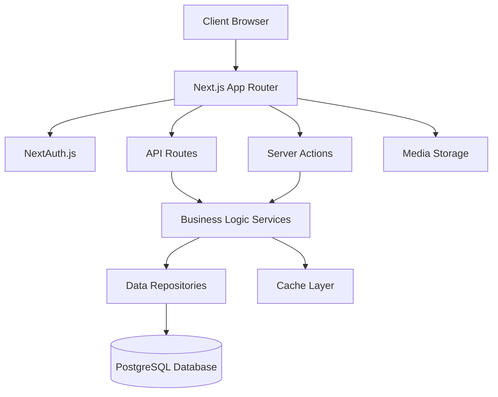
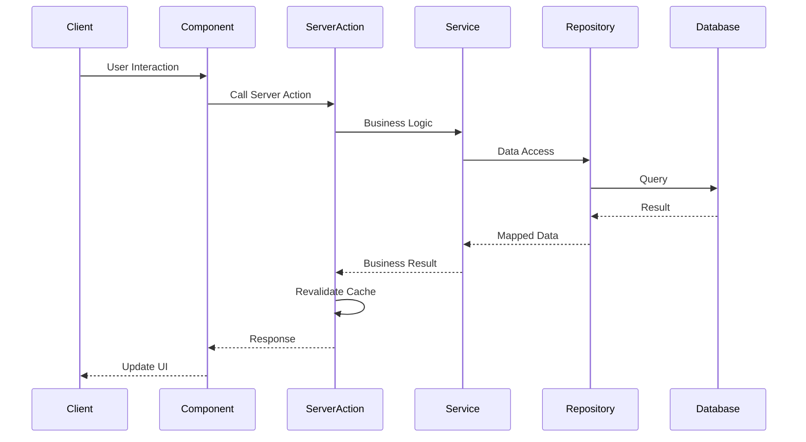
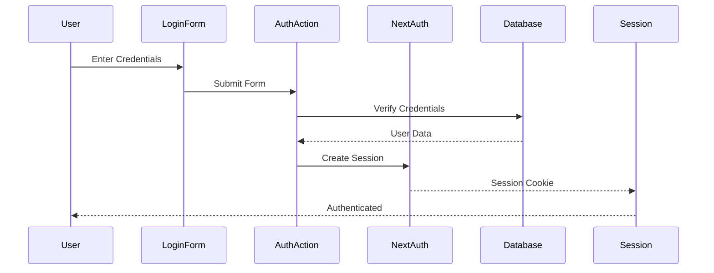
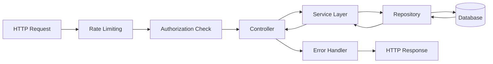
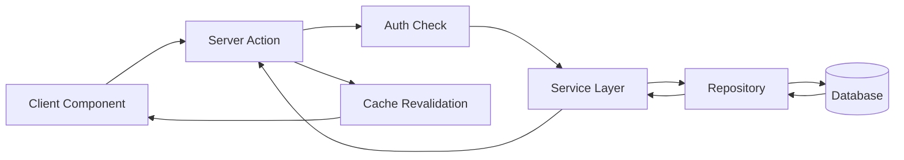

# Architecture Documentation

This document describes the architecture of the Artiverse Galleria application, including system design, data flow, and architectural decisions.

## Table of Contents

1. [Overview](#overview)
2. [System Architecture](#system-architecture)
3. [Feature-Based Architecture](#feature-based-architecture)
4. [Data Flow](#data-flow)
5. [Authentication Flow](#authentication-flow)
6. [Request/Response Flow](#requestresponse-flow)
7. [Repository → Service → Action Pattern](#repository--service--action-pattern)
8. [Caching Strategy](#caching-strategy)
9. [Database Schema](#database-schema)

## Overview

Artiverse Galleria is a full-stack e-commerce art gallery platform built with:

- **Frontend Framework:** Next.js 16 (App Router)
- **Language:** TypeScript
- **Database:** PostgreSQL with Drizzle ORM
- **Authentication:** NextAuth.js v5
- **Styling:** Tailwind CSS
- **State Management:** React Context API, TanStack Query

## System Architecture



## Feature-Based Architecture

The application follows a **feature-based architecture** where code is organized by business domain rather than technical layer.

### Directory Structure

```
src/
├── features/              # Feature modules
│   ├── authentication/   # Authentication feature
│   │   ├── actions/      # Server actions
│   │   ├── components/   # UI components
│   │   ├── lib/          # Business logic, services, repositories
│   │   └── types/        # Type definitions
│   ├── products/         # Products feature
│   ├── artists/          # Artists feature
│   ├── media/             # Media management feature
│   └── ...
├── components/            # Shared UI components
├── lib/                  # Shared utilities and infrastructure
├── shared/               # Shared constants and types
└── types/                # Global type definitions
```

### Benefits

- **Scalability:** Easy to add new features without affecting existing ones
- **Maintainability:** Related code is co-located
- **Team Collaboration:** Teams can work on different features independently
- **Clear Boundaries:** Each feature is self-contained

## Data Flow

### Client to Server Flow



## Authentication Flow



### Authentication Components

1. **NextAuth.js v5:** Handles session management, JWT tokens, and OAuth providers
2. **Middleware:** Protects routes based on authentication status
3. **`requireAuth()`:** Server-side authorization check for protected actions
4. **Role-Based Access Control (RBAC):** User roles (Admin, Editor, ShopManager, User)

## Request/Response Flow

### API Route Flow



### Server Action Flow



## Repository → Service → Action Pattern

The application follows a three-layer architecture pattern:

### 1. Repository Layer (`lib/repositories/`)

**Responsibility:** Data access and database operations

- Direct interaction with database
- Query building and execution
- Data mapping from database to application types
- Transaction management

**Example:**

```typescript
export class ProductsRepository extends BaseRepository {
  async getAll(): Promise<{ products: Product[]; total: number }> {
    // Database query logic
  }
}
```

### 2. Service Layer (`lib/services/`)

**Responsibility:** Business logic and orchestration

- Business rules and validation
- Orchestrates multiple repository calls
- Error handling and transformation
- Caching logic

**Example:**

```typescript
export default class ProductsService {
  async create(data: ProductCreate): Promise<Product> {
    // Business logic
    // Validation
    // Call repository
  }
}
```

### 3. Action Layer (`actions/`)

**Responsibility:** Server actions for client components

- Form handling
- Cache revalidation
- Response formatting
- Error handling for UI

**Example:**

```typescript
export async function createProduct(data: ProductCreate) {
  try {
    const product = await productsService.create(data)
    revalidatePath('/admin/products')
    return { success: true, data: product }
  } catch (error) {
    return { success: false, error: 'Failed to create product' }
  }
}
```

## Caching Strategy

### Cache Levels

1. **Next.js Cache:** Built-in caching for static pages and API routes
2. **Unstable Cache:** For server-side data fetching with tags
3. **Browser Cache:** HTTP cache headers for static assets

### Cache Tags

- `products` - Product-related data
- `artists` - Artist-related data
- `media` - Media files metadata
- `users` - User data (admin only)

### Cache Invalidation

- **Revalidation:** Automatic revalidation on data mutations
- **Tag-based:** Invalidate by cache tags
- **Path-based:** Invalidate specific routes

## Database Schema

### Core Tables

- `users` - User accounts and authentication
- `artists` - Artist profiles and information
- `products` - Artwork/products for sale
- `media` - Media files (images) stored as bytea
- `orders` - Customer orders
- `order_items` - Individual items in orders
- `analytics_events` - Analytics tracking data

### Relationships

- Products → Artists (many-to-one)
- Orders → Users (many-to-one)
- Orders → Order Items (one-to-many)
- Products → Media (many-to-many via image URLs)

### Indexes

- Unique index on `products.sku`
- Indexes on foreign keys for performance
- Indexes on frequently queried fields

## Security Architecture

### Rate Limiting

- In-memory LRU cache for rate limiting
- Different limits for different endpoints
- IP-based tracking

### Security Headers

- X-Frame-Options: DENY
- X-Content-Type-Options: nosniff
- Referrer-Policy: strict-origin-when-cross-origin
- Strict-Transport-Security (HSTS)

### Authentication Security

- Password hashing with bcrypt
- JWT session tokens
- CSRF protection (Next.js built-in)
- Secure cookie settings

## Performance Optimizations

1. **Image Optimization:** Sharp library for image processing
2. **Code Splitting:** Dynamic imports for large components
3. **Static Generation:** Where appropriate
4. **Caching:** Multiple cache layers
5. **Database Indexing:** Optimized queries

## Deployment Architecture

### Production Setup

- **Application:** Next.js standalone build in Docker
- **Database:** PostgreSQL (managed or self-hosted)
- **Reverse Proxy:** Nginx or cloud load balancer
- **CDN:** For static assets (optional)

### Environment Variables

All configuration via environment variables (see `.env.example`)

## Future Considerations

1. **Redis:** For distributed rate limiting and caching
2. **CDN:** For media file delivery
3. **Monitoring:** APM and error tracking
4. **Scaling:** Horizontal scaling with load balancer
5. **Microservices:** If needed for specific features
